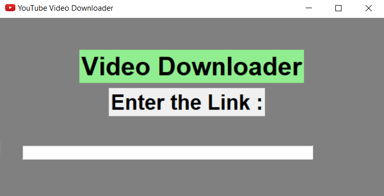
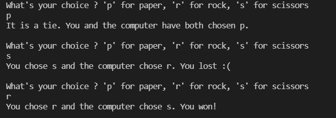
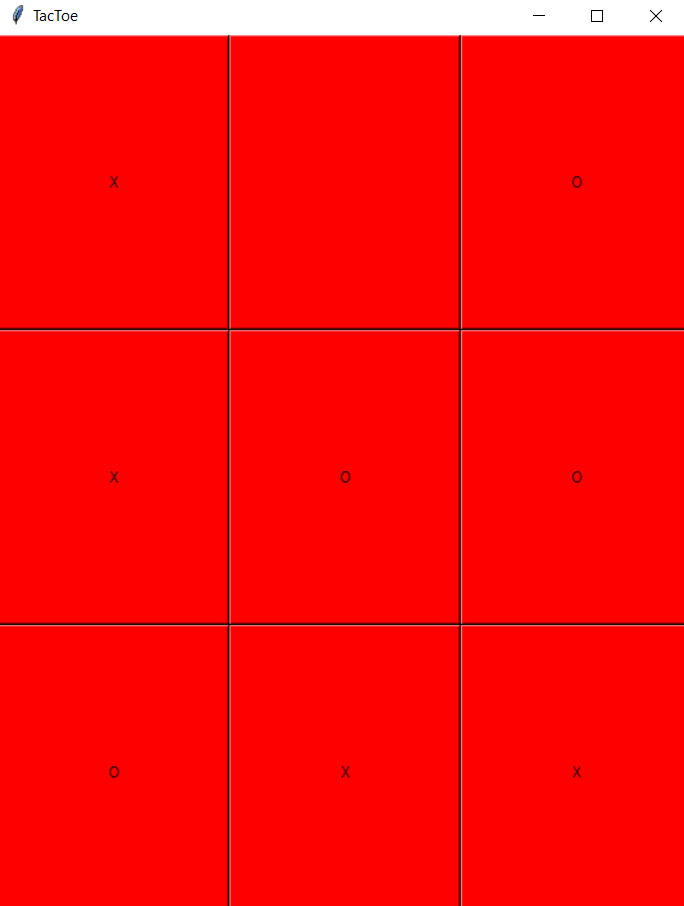

# Mini-Pojects

This is a repositary containg all the mini projects that I have made using the languages that I have learned from.

## Video_downloader.py

Use the package manager [pip](https://pip.pypa.io/en/stable/) to install Pytube and  Tkinter.

```bash
pip install pytube
pip install Tkinter
```
```python
1 Clone this repository in your desired directory.
2 Make a blank folder - "y_downloads", all the videos will be downloaded and saved here.
3 Run the command: python3 Video_downloader.py.
4 Enter the YouTube Video URL in the text box and click the Download button.
```



## Game.py
Use the package manager [pip](https://pip.pypa.io/en/stable/) to install random and  math.

```bash
pip install random
pip install math
```
```python
1 Clone this repository in your desired directory.
2 Run the command: python3 Game.py.
3 and try to beat me :)
```



## Tactoe.py
```python
1 Clone this repository in your desired directory.
2 Run the command: python3 Tactoe.py.
3 Enjoy!
```

